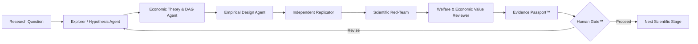

# ECONOVA-S™ AI-to-AI Scientific Automation

## Purpose

The **AI-to-AI Scientific Automation Fabric™** is the governed runtime that coordinates specialized scientific agents across ECONOVA-S™. It is **not a third core**. It connects the Stable Economic Knowledge Core™ and Replaceable Technology Core™ through explicit, machine-readable scientific handoffs.

The objective is not to make AI an autonomous scientific authority. The objective is to make scientific work **modular, reviewable, reproducible, adversarial, tamper-evident, and stoppable**.

> **Generate → Challenge → Replicate → Falsify → Interpret → Human Gate**

## Canonical agent sequence



### 1. Explorer / Hypothesis Agent
Generates competing mechanisms and hypotheses. It must expose assumptions, contradictions, and uncertainty rather than returning a single preferred answer.

### 2. Economic Theory & DAG Agent
Maps the hypothesis to economic theory, constructs, causal pathways, feedback loops, confounders, mediators, and identification assumptions.

### 3. Empirical Design Agent
Translates the proposed mechanism into variables, authoritative data sources, chronology rules, estimators, falsification tests, OOS tests, and publication-style outputs.

### 4. Independent Replicator
Attempts to reproduce the design and results from the evidence package without relying on the generator's hidden reasoning. Failure to reproduce is a first-class scientific output.

### 5. Scientific Red-Team
Searches for alternative explanations, leakage, p-hacking risk, construct drift, invalid comparisons, unsupported causal language, data-quality failures, and omitted robustness tests.

### 6. Welfare & Economic Value Reviewer
Separates private value from social value and assesses externalities, distributional effects, market power, environmental effects, privacy costs, and economic magnitude where relevant.

### 7. Evidence Passport™
Freezes provenance for the question, evidence, data, code, model/tool versions, assumptions, results, contradictions, failures, robustness, replication, and human decision.

### 8. Human Gate™
No agent may self-authorize a scientific discovery. Human approval is required before any claim is promoted to the next scientific stage.

## Machine-readable handoff contract

Every agent-to-agent message contains:

```text
TaskID
RunID
Sender
Receiver
Claim
Evidence
Method
Assumptions
Confidence
Contradictions
FailureStatus
Provenance
ParentHash
IndependenceClass
RiskFlags
RequiredNextAction
ContentSHA256
```

The canonical schema is stored at:

`automation/ai_handoff.schema.json`

Each handoff is SHA-256 hashed and linked to the previous handoff through `ParentHash`. The complete run therefore has a tamper-evident chain and a final run hash.

## Scientific independence rule

A review is not considered independent merely because a second prompt or second agent label is used. Independence should be strengthened by one or more of the following:

- separate role with isolated context;
- a different model or model family;
- a different tool or execution configuration;
- an independent data/code execution path;
- independent reconstruction from the Evidence Passport;
- a frozen pre-analysis protocol;
- blinded benchmark or temporal holdout evaluation;
- external human review.

The automation records an explicit `IndependenceClass` so apparent diversity is not confused with genuine independence.

## Stop conditions and fault containment

The automation must stop or return to revision when any of the following is true:

- required evidence is missing;
- data provenance cannot be verified;
- chronology or leakage checks fail;
- the construct cannot be operationalized consistently;
- identification is claimed but not supported;
- replication fails materially;
- red-team contradictions remain unresolved;
- robustness/falsification gates fail;
- welfare interpretation is materially incomplete when required;
- the Human Gate does not approve progression.

Failure is a valid scientific result and is propagated explicitly. It is never silently converted into success.

## Routing rule

```text
IF evidence_missing OR provenance_failed
    → Evidence/Data Agent
ELSE IF construct_invalid
    → Variable DNA & Construct Agent
ELSE IF identification_invalid
    → Econometrics & Identification Agent
ELSE IF replication_failed
    → Replicator + Generator disagreement loop
ELSE IF red_team_unresolved
    → Adversarial revision loop
ELSE
    → Evidence Passport → Human Gate
```

## Runnable implementation

The public repository includes:

- `automation/orchestrator.py` — deterministic seven-stage orchestration runtime;
- `automation/ai_handoff.schema.json` — machine-readable handoff contract;
- `automation/validate_handoff.py` — schema/hash validator;
- `automation/test_orchestrator.py` — governance and failure-containment tests;
- `automation/RELIABILITY_STANDARD.md` — reliability and fault-containment standard;
- `automation/README.md` — developer guide for provider adapters;
- `.github/workflows/ai_to_ai_contract.yml` — zero-secret CI contract validation and trace generation.

The deterministic governance/fault-containment suite passed **3/3 local tests** in the latest development pass. A successful remote GitHub Actions run has not yet been independently verified through the connected GitHub interface, so remote CI is not claimed as passed.

## Provider-neutral design

The scientific contract is independent of the model provider. GPT/OpenAI, Microsoft/Azure, Google, local models, or future systems may be attached as replaceable implementations without changing the Stable Economic Knowledge Core™ or the governance rules.

Live model calls belong in the Replaceable Technology Core and should use authorized environment/repository secrets only in explicitly approved workflows.

## Non-bypassable scientific invariants

```text
agent_consensus_is_scientific_truth = false
human_gate_required = true
human_gate_approved = false   # default
discovery_claim_allowed = false
```

**Engineering rule:** automate execution, not scientific authority.

## Google Drive synchronization

The current AI-to-AI runtime and reliability layer is also preserved in Google Drive:

- Canonical AI-to-AI runtime & reliability record: https://docs.google.com/document/d/1R0T361C5G1aXhG4wvpkL8s39bUjB33XbgB3Wwgkcd-0/edit
- ECONOVA-S™ Canonical Architecture V2.5: https://docs.google.com/document/d/1l3cZJY23FJr_9oiEPc2vRCrH6Er96AfQX-WAoCzJIRQ/edit
- Cross-system sync record: `DRIVE_SYNC_AI_TO_AI.md`

## Independence statement

ECONOVA-S™ is an independent research project. References to Microsoft, OpenAI, Google, DeepMind, Azure, or other organizations and technologies identify engineering inspiration, model providers, or interoperability targets only and do not imply sponsorship, employment, endorsement, or organizational affiliation unless explicitly documented.
