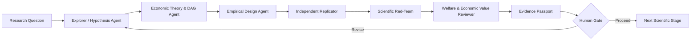

# ECONOVA-S™ AI-to-AI Scientific Automation

## Purpose

The **AI-to-AI Scientific Automation Fabric™** is the governed runtime that coordinates specialized scientific agents across ECONOVA-S™. It is **not a third core**. It connects the Stable Economic Knowledge Core™ and Replaceable Technology Core™ through explicit, machine-readable scientific handoffs.

The objective is not to make AI autonomous authority. The objective is to make scientific work **modular, reviewable, reproducible, adversarial, and stoppable**.

> **Generate → Challenge → Replicate → Falsify → Interpret → Human Gate**

## Canonical agent sequence



### 1. Explorer / Hypothesis Agent
Generates competing mechanisms and hypotheses. It must expose assumptions, contradictions, and uncertainty rather than returning a single preferred answer.

### 2. Economic Theory & DAG Agent
Maps the hypothesis to economic theory, constructs, causal pathways, feedback loops, confounders, mediators, and identification assumptions.

### 3. Empirical Design Agent
Translates the proposed mechanism into real variables, data sources, chronology rules, estimators, falsification tests, OOS tests, and publication-style outputs.

### 4. Independent Replicator
Attempts to reproduce the design and results from the evidence package without relying on the generator's hidden reasoning. Failure to reproduce is a first-class output.

### 5. Scientific Red-Team
Searches for alternative explanations, leakage, p-hacking risk, construct drift, invalid comparisons, unsupported causal language, data-quality failures, and omitted robustness tests.

### 6. Welfare & Economic Value Reviewer
Separates private value from social value and assesses externalities, distributional effects, market power, environmental effects, privacy costs, and economic magnitude where relevant.

### 7. Evidence Passport™
Freezes provenance for the question, evidence, data, code, model/tool versions, assumptions, results, contradictions, failures, robustness, replication, and human decision.

### 8. Human Gate™
No agent may self-authorize a scientific discovery. Human approval is required before any claim is promoted to the next scientific stage.

## Machine-readable handoff contract

Every agent-to-agent message should contain the following fields:

```text
TaskID
RunID
Sender
Receiver
Claim
Evidence
Method
Assumptions
Confidence
Contradictions
FailureStatus
Provenance
RequiredNextAction
ContentSHA256
```

The canonical schema is stored at:

`automation/ai_handoff.schema.json`

## Scientific independence rule

A review is not considered independent merely because a second prompt is used. Independence should be strengthened by one or more of the following:

- a separate model or model family;
- isolated context that does not reveal the generator's preferred answer;
- a separate data/code execution path;
- independent reconstruction from the Evidence Passport;
- a frozen pre-analysis protocol;
- blinded benchmark or holdout evaluation;
- external human review.

## Stop conditions

The automation must stop or return to revision when any of the following is true:

- required evidence is missing;
- data provenance cannot be verified;
- chronology or leakage checks fail;
- the construct cannot be operationalized consistently;
- identification is claimed but not supported;
- replication fails materially;
- red-team contradictions remain unresolved;
- robustness/falsification gates fail;
- welfare interpretation is materially incomplete when required;
- the Human Gate does not approve progression.

## Routing rule

```text
IF evidence_missing OR provenance_failed
    → Evidence/Data Agent
ELSE IF construct_invalid
    → Variable DNA & Construct Agent
ELSE IF identification_invalid
    → Econometrics & Identification Agent
ELSE IF replication_failed
    → Replicator + Generator disagreement loop
ELSE IF red_team_unresolved
    → Adversarial revision loop
ELSE
    → Evidence Passport → Human Gate
```

## GitHub automation

The repository includes a zero-secret CI workflow that validates the AI-to-AI contract and sample handoffs:

`.github/workflows/ai_to_ai_contract.yml`

This workflow deliberately does **not** call paid model APIs or expose model keys. Live model execution belongs in the Replaceable Technology Core and should use repository/environment secrets only in explicitly authorized workflows.

## Relationship to existing ECONOVA-S software

The current v0.2 engine already separates hypothesis generation, ERA-style empirical design, and red-team review. The AI-to-AI automation layer generalizes that pattern into a reusable, vendor-neutral multi-agent contract with explicit replication, failure propagation, provenance, and Human Gate controls.

## Scientific boundary

AI-to-AI agreement is **not** scientific validation. Multiple agents can share the same blind spots, training priors, retrieval errors, or specification mistakes.

Therefore:

`agent_consensus != scientific_truth`

and

`discovery_claim_allowed = false`

until the applicable evidence, identification, replication, falsification, economic-significance, welfare, and human-review gates are satisfied.
