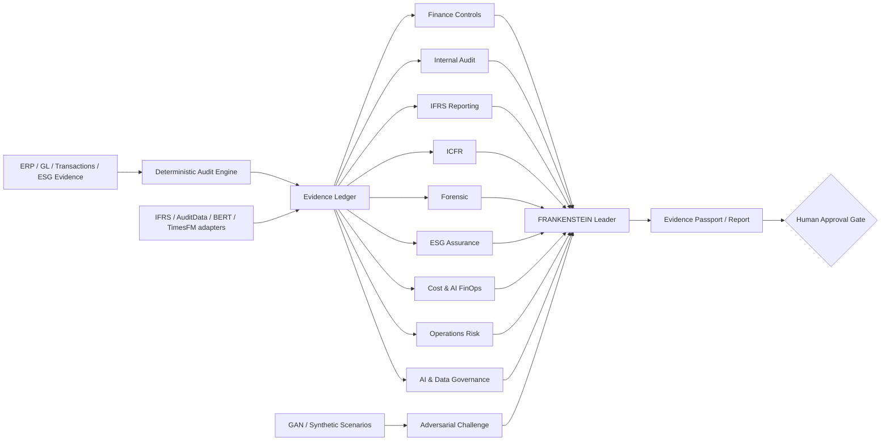

# FRANKENSTEIN Architecture

FRANKENSTEIN is a specialist programme inside NAAIL OpenLab. It does not alter the frozen two-core constitution.

## Invariants

1. Deterministic tests precede generative interpretation where feasible.
2. Evidence and inference are stored and described separately.
3. Specialist consensus is not professional authority.
4. Missing evidence must be surfaced, not invented.
5. Model providers and agent SDKs are replaceable; the professional architecture must not depend on one vendor.
6. Cost optimization cannot override required evidence quality, reproducibility or professional judgment.
7. Consequential conclusions require a Human Approval Gate.

## Replaceable provider profiles

The public FRANKENSTEIN programme may contain multiple technology profiles under the same professional governance. Current examples include the Claude-enabled base implementation and the [OpenAI Finance & Operations Audit profile](openai_finops/README.md). Provider-specific code belongs to the Replaceable Technology Core; professional evidence and Human Gate requirements do not change with provider.
