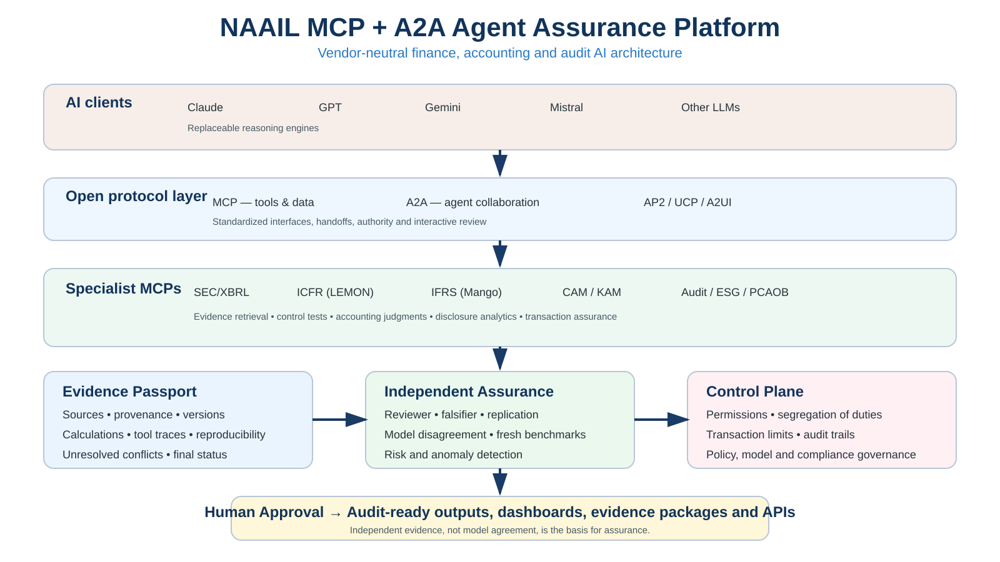

# NAAIL MCP + A2A Agent Assurance Platform

> **V0.1 research/engineering POC** for vendor-neutral, evidence-first multi-agent assurance in accounting, audit and finance.



## Why this exists

MCP standardizes access to tools and data. A2A supports agent-to-agent delegation and handoffs. NAAIL adds the missing assurance layer: **evidence provenance, reproducible calculations, independent review, falsification, control enforcement and human approval**.

The central design rule is simple:

> **Model agreement is not evidence.**

Claude, GPT, Gemini, Mistral or another model may generate or review work, but a material conclusion is not treated as assured merely because multiple models agree.

## Architecture

```text
Claude / GPT / Gemini / Mistral / other LLMs
                      |
                      v
                A2A Agent Mesh
                      |
                      v
                  MCP Gateway
                      |
     +----------------+----------------+
     |                |                |
 SEC/XBRL           ICFR             IFRS
     |                |                |
   CAM/KAM          Audit          ESG/PCAOB
     +----------------+----------------+
                      |
               Evidence Passport
                      |
       Independent Reviewer / Falsifier
                      |
                 Control Plane
                      |
                Human Approval
                      |
          Audit-ready outputs / APIs
```

## What is executable today

V0.1 contains a small dependency-free reference implementation for the **Evidence Passport**:

- machine-readable Evidence Passport schema;
- machine-readable A2A handoff envelope;
- canonical SHA-256 content fingerprint;
- evidence-reference integrity checks;
- human-gate consistency checks;
- command-line validation;
- unit tests;
- GitHub Actions CI.

This is a contract POC, **not yet a production assurance engine** and not evidence of superior accuracy.

## Quick start

From the repository root:

```bash
export PYTHONPATH=MCP-A2A-Agent-Assurance/src
python -m naail_agent_assurance.cli validate \
  MCP-A2A-Agent-Assurance/examples/evidence_passport.example.json

python -m unittest discover \
  -s MCP-A2A-Agent-Assurance/tests -v
```

Expected validator result:

```text
PASS: Evidence Passport minimum contract validated
```

## Project structure

| Path | Purpose |
|---|---|
| `ARCHITECTURE.md` | protocol, assurance and control architecture |
| `GOVERNANCE.md` | independence, benchmark integrity and human authority |
| `SECURITY.md` | least privilege, segregation of duties and high-impact controls |
| `RESEARCH_DESIGN.md` | hypotheses and staged evaluation design |
| `ROADMAP.md` | build sequence and research/product gates |
| `schemas/` | Evidence Passport and agent-handoff contracts |
| `src/naail_agent_assurance/` | executable reference validator |
| `examples/` | non-empirical demonstration fixtures |
| `tests/` | contract and governance tests |

## Specialist MCP roadmap

1. **SEC/XBRL Data MCP** — reproducible filing/fact retrieval.
2. **LEMON-ICFR-US MCP** — control evidence and deficiency analysis.
3. **Apple-CAM-US MCP** — CAM retrieval and account/topic analysis.
4. **Orange-KAM-EU-UK MCP** — KAM extraction and longitudinal comparison.
5. **Mango-IFRS MCP** — standards-grounded accounting analysis.
6. **Finance & Operations Audit MCP** — GL/AP/AR tests and anomalies.
7. **Research Assurance MCP** — provenance, replication and falsification.
8. **A2A orchestration** — collaboration only after specialist agents pass their own gates.
9. **Agentic transaction assurance** — AP2/UCP-style authorization evidence where relevant.
10. **Interactive professional UI** — A2UI/MCP Apps after the assurance contracts stabilize.

## Evidence Passport

Every material result should be capable of recording:

- task identity and risk level;
- generator/provider/model/version;
- source IDs and retrieval timestamps;
- claims linked to evidence;
- deterministic calculations;
- reviewer/challenger results;
- unresolved conflicts;
- human-approval state;
- final evidence status;
- canonical content fingerprint.

Supported evidence states are **VERIFIED, REPLICATED, INFERRED, UNRESOLVED, FALSIFIED** and **DRAFT**.

## Research program

The proposed research compares:

1. base LLM;
2. single agent + MCP tools;
3. specialist agents + A2A;
4. multi-agent + independent reviewer/falsifier;
5. the full architecture + risk-triggered human approval.

Primary outcomes include accuracy, unsupported-claim rate, evidence completeness, reproducibility, calibration, defect detection, human override quality, latency, cost and traceability.

**Fresh blinded holdouts are mandatory for confirmatory claims.** Once a case is inspected during development, it is no longer an independent test case.

## AI-for-science design inspiration

The architecture borrows design ideas—not empirical claims—from:

- **AlphaFold:** benchmark discipline and confidence-aware scientific prediction;
- **AlphaEvolve:** generate → evaluate → iterate loops;
- **AI co-scientist systems:** role specialization, critique and refinement;
- **multi-agent handoff systems:** explicit delegation and bounded tool authority.

NAAIL adapts these ideas to accounting/audit evidence, controls, standards, calculations and human accountability.

## Governance and security

Read [GOVERNANCE.md](GOVERNANCE.md) and [SECURITY.md](SECURITY.md).

High-impact actions such as payments, accounting entries, source-of-record changes, benchmark-label changes and final assurance sign-off should default to explicit authorization and human approval.

## Current gate

The next engineering gate is:

**SEC/XBRL MCP → LEMON ICFR MCP → Evidence Passport → independent reviewer/falsifier → human approval**

A2A orchestration should not be treated as validated until at least two specialist agents independently pass fresh benchmark gates.
