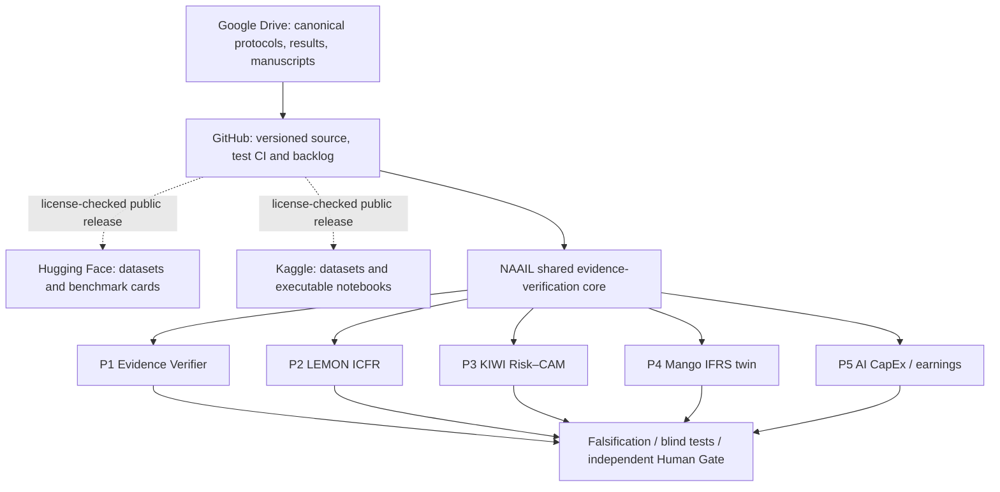

# NAAIL OpenLab™ — Five-Product Cross-Platform Master Map
Updated **10 October 2026** · **Planning/resumption index — no new inference or empirical results** · Saeid Homayoun

## Canonical four-platform arrangement
**Google Drive is the authoritative master archive** ([MASTER INDEX](https://docs.google.com/document/d/13YuiD7AdCpMDqdJ8Oi9BxDC53YI5MG8lK-6V2cbcgVs/edit); [five-product folder](https://drive.google.com/drive/folders/1SxnMdK99rS9ixLEsQVflSoLULjMTtSfk)). **GitHub** is the versioned code/documentation/issues mirror. **Hugging Face and Kaggle** are public benchmark/notebook distribution platforms, only after a license/data review and actual upload verification.

| Platform | Existing or created destination | Status / responsibility |
|---|---|---|
| Google Drive | [PROJECT_DEVELOPER_5_PRODUCTS_2026](https://drive.google.com/drive/folders/1SxnMdK99rS9ixLEsQVflSoLULjMTtSfk) and five product subfolders | Folder structure created; master index is separate from existing ICFR/CAM/IFRS project archives |
| GitHub | [NAAIL main repository](https://github.com/Saehon/Saeid-Homayoun) and this file | Proposed master map on a PR branch (do not imply merged); backlogged development tracked by a GitHub issue |
| Hugging Face | [Existing portfolio dataset](https://huggingface.co/datasets/SADHON/accounting-audit-ai-portfolio) and [free-data registry](https://huggingface.co/datasets/SADHON/aws-free-accounting-audit-finance-registry) | Existing datasets verified; **five-product benchmark not uploaded**. Connector offers read-only repo access |
| Kaggle | [Existing portfolio dataset](https://www.kaggle.com/datasets/sadhon/accounting-audit-ai-portfolio), [Start Here notebook](https://www.kaggle.com/code/sadhon/accounting-audit-ai-portfolio-start-here) | Existing GitHub portfolio links; **five-product benchmark not uploaded**; no connected Kaggle write action |

## Five product-to-research mappings
| ID | Product | Drive folder | Existing starting point | Empirical pilot, proposed claim and target |
|---|---|---|---|---|
| P1 | **NAAIL Evidence Verifier** | [Drive](https://drive.google.com/drive/folders/1F3F-0it9AFMXnVfFcGKr_dg2RLlHScfa) | [Existing starting point](https://github.com/Saehon/IFRS-AI-Inspector) | 100–200 public/synthetic independently adjudicated accounting cases; ordinary agents versus independent verification. **Hypothesis:** Does independent evidence verification reduce unsupported accounting claims? **Candidate journals:** TAR / JAR / AJPT |
| P2 | **LEMON Agentic ICFR Auditor** | [Drive](https://drive.google.com/drive/folders/1t0dyYT86bXU9P5ygg4bb4H7iNZF9Ge5F) | [Existing starting point](https://github.com/Saehon/Saeid-Homayoun/pull/152) | Extend 18 synthetic smoke-test cases; add blinded ICFR labels and public SEC validation with chronological holdouts. **Hypothesis:** Do independently verified AI risk scores predict ICFR weaknesses or later reporting problems? **Candidate journals:** TAR / JAR / JAE / AJPT |
| P3 | **KIWI Risk–CAM Alignment Agent** | [Drive](https://drive.google.com/drive/folders/1SeNnfCBVyXz_llu89LC6hojb9gN_jMyU) | [Existing starting point](https://github.com/Saehon/Saeid-Homayoun/tree/main/NAAIL-OpenLab/KIWI) | Independent inventory, goodwill, revenue account-level risk scoring matched to CAM topics. **Hypothesis:** Does CAM omission/misalignment conditional on pre-disclosure risk forecast subsequent reporting events? **Candidate journals:** TAR / JAR / JAE |
| P4 | **Mango IFRS Digital Twin** | [Drive](https://drive.google.com/drive/folders/1vvu5xQZO6vO8PxGA2WqN_kp49T-_UAqc) | [Existing starting point](https://github.com/Saehon/IFRS-AI-Inspector) | Synthetic IFRS 15 and IAS 36 judgments; deterministic reconciliation; blind reviewer rating. **Hypothesis:** Does independent agent review improve evidence sufficiency and accounting-judgment consistency? **Candidate journals:** TAR / Management Science (fit unconfirmed) |
| P5 | **AI CapEx & Earnings Intelligence** | [Drive](https://drive.google.com/drive/folders/1Du7cN12LOdIJhRVF7PoZoBVEGQyrN9kE) | [Existing starting point](https://docs.google.com/document/d/18PHV4IpBWahXPmVvSAV8fcRZsIwza-CTHQ2JxZYe-CI/edit) | Microsoft exploratory case, followed by SEC/XBRL public panel linked to permitted returns and factors. **Hypothesis:** Do evidence-verified AI CapEx signals add return/earnings information after conventional controls? **Candidate journals:** JoF / JFE / RFS / Management Science (stretch) |

**Status limits:** No causal estimate, statistically significant result, novel hypothesis verification, journal acceptance or production-ready audit tool follows from this map. P2's Decision-1 pilot has **18 synthetic smoke-test cases with offline CI passed**, but *no hosted Decision-1 empirical evaluation*. The previously written finance study contains *no estimated public SEC/returns panel*.

## Shared software stack and external developer pathways
- **OpenAI:** [Agents SDK](https://github.com/openai/openai-agents-python), [OpenAI Cookbook](https://github.com/openai/openai-cookbook), [Sign-in DevKit](https://github.com/openai/sign-in-with-chatgpt-devkit). Candidate P1/P2 contribution: reproducible evidence verification example, not an official partnership.
- **Anthropic:** [Finance plugin](https://github.com/anthropics/knowledge-work-plugins/tree/main/finance), [financial-services](https://github.com/anthropics/financial-services). Candidate P2/P4 contribution: independent SOX/reconciliation assurance skill.
- **Google:** [ADK Recipes](https://github.com/google/adk-recipes), [ADK Python](https://github.com/google/adk-python). Candidate P1/P3 contribution: auditable SEC/XBRL agent recipe.
- **Public data:** [SEC EDGAR API](https://www.sec.gov/search-filings/edgar-application-programming-interfaces), [Arelle XBRL parser](https://github.com/Arelle/Arelle), [Ken French Data Library](https://mba.tuck.dartmouth.edu/pages/faculty/ken.french/data_library.html). Public availability does not establish redistribution rights for every derived dataset.

## Scientific and governance gates — pending, not completed
- [ ] G0. Register a systematic FT50/AJG review/novelty matrix; distinguish existing findings from new falsifiable hypotheses.
- [ ] G1. Freeze common evidence schema, provenance passport, deterministic XBRL/IFRS checks, standardized provider adapters and human-gate contract.
- [ ] G2. Inventory data licences/privacy, separate public NAAIL code from **private POMELO** source, and protect secrets/identifiable client information.
- [ ] G3. Freeze independent blind labels, negative controls, temporal/firm holdouts, documentation and baseline models.
- [ ] G4. Run matched provider evaluations **only with explicit spend authorization**, preserved prompts/model IDs and equivalent information budgets.
- [ ] G5. Report precision, recall, false negatives, appropriate abstentions, supported/unsupported claims, PR-AUC/calibration where meaningful, reviewer burden, costs and CIs.
- [ ] G6. Preregister confirmatory tests; evaluate leakage, robustness, falsification, multiple testing, and human adjudicator agreement.
- [ ] G7. Publish verified GitHub CI, replication code, checksums, licence manifests, reproducible notebooks and *all* limitations, including null findings.
- [ ] G8. After independent approval, upload eligible public artifacts to HF and Kaggle; verify published URLs/files/versions by readback and update Drive first.
- [ ] G9. Draft targeted journal manuscripts only after real evidence; finance studies require defensible identification and incremental information beyond established factors/text.
- [ ] G10. Independent Human Gate release approval; no AI system self-certifies SOX/IFRS or produces an autonomous audit opinion.

## Three-month backlog to resume later
- **Days 1–30:** P1 evidence core/P2 test contract, blind adjudication and preanalysis plan.
- **Days 31–60:** Claude/Gemini adapters, P3 CAM ontology, licensed SEC ingestion and leakage controls.
- **Days 61–90:** P4 IFRS judgment cases, P5 public finance data feasibility, open replication packaging and manuscript go/no-go decisions.

**Preserve these existing research records without copying/moving or deleting:** [NAAIL Decision-1 current pilot evidence](https://docs.google.com/document/d/1zugMqqio6LW1nhPrDknmjIYkddqin6dH12xrVqG3t5A/edit), [NAAIL Decision-1 finance study](https://docs.google.com/document/d/18PHV4IpBWahXPmVvSAV8fcRZsIwza-CTHQ2JxZYe-CI/edit), [IFRS-AI Inspector](https://github.com/Saehon/IFRS-AI-Inspector), [NAAIL OpenLab](https://github.com/Saehon/Saeid-Homayoun).

### Resume checkpoint
Begin with G0–G3 and P1/P2; do not start paid hosted inference, publish third-party data, or merge an unreviewed release. Update Drive, then PR/issues, then distribute public artifacts to HF/Kaggle after verification.