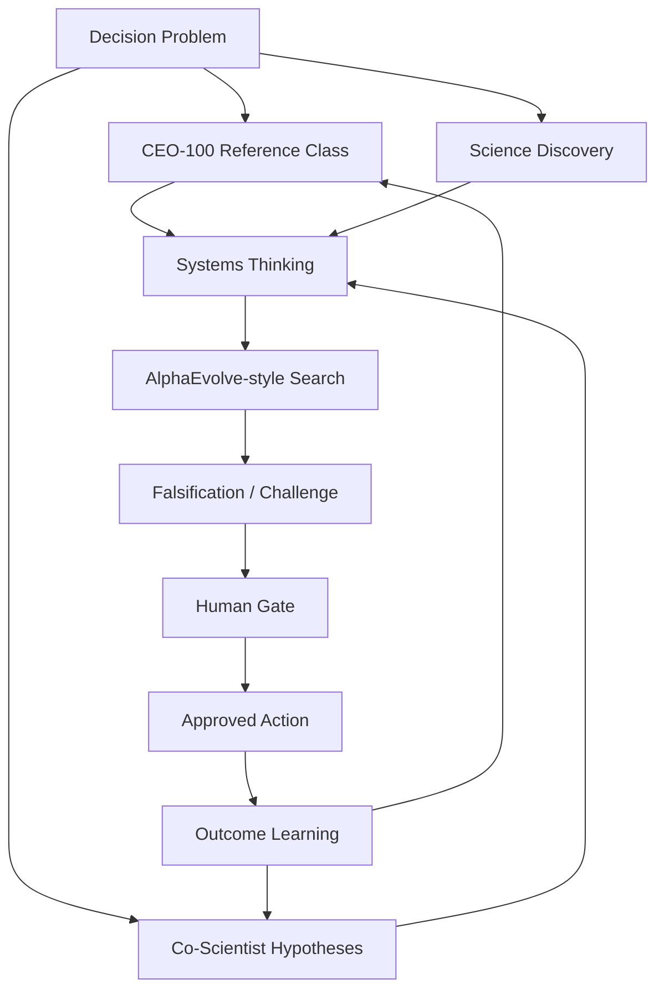
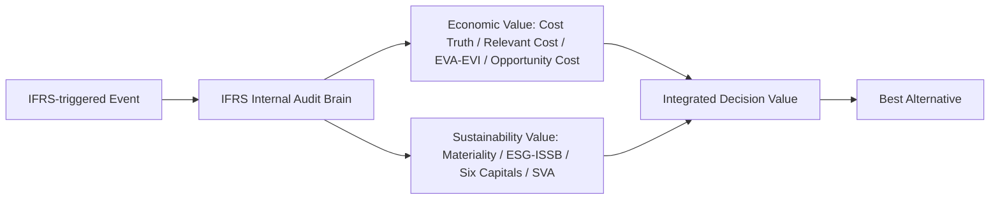

# Diagrams

## Integrated architecture

```mermaid
flowchart LR
    ERP[ERP / Event Data] --> IFRS[IFRS Accounting Brain]
    IFRS --> AUDIT[Internal Audit Assurance]
    AUDIT --> COST[Cost Truth + Management Accounting]
    COST --> ECON[Economic Value Hemisphere]
    COST --> SUST[Sustainability Value Hemisphere]
    ECON --> GRAPH[Six-Capital + Systems Graph]
    SUST --> GRAPH
    GRAPH --> OPP[Opportunity Cost]
    OPP --> CF[Counterfactual Engine]
    CF --> DARWIN[DARWIN MetaBrain]
    DARWIN --> GATE[Pre-Transaction Value Gate]
    GATE --> HUMAN[Human Approval]
    HUMAN --> ACTION[ERP Action]
    ACTION --> OUTCOME[Actual Outcome]
    OUTCOME --> LEARN[Outcome & Learning]
    LEARN --> DARWIN
```

## DARWIN MetaBrain

```mermaid
flowchart TB
    EVENT[Decision Problem] --> CEO[CEO-100 Reference Class]
    EVENT --> CO[Co-Scientist Hypotheses]
    EVENT --> DISC[Science Discovery]
    CEO --> SYS[Systems Thinking]
    CO --> SYS
    DISC --> SYS
    SYS --> EVO[AlphaEvolve-style Search]
    EVO --> FALSIFY[Falsification / Challenge]
    FALSIFY --> HUMAN[Human Gate]
    HUMAN --> OUT[Approved Action]
    OUT --> LEARN[Outcome Learning]
    LEARN --> CEO
    LEARN --> CO
```

## Value hemispheres

```mermaid
flowchart LR
    E[IFRS-triggered Event] --> B[IFRS Internal Audit Brain]
    B --> L[Economic Value: Cost Truth / Relevant Cost / EVA-EVI / Opportunity Cost]
    B --> R[Sustainability Value: Materiality / ESG-ISSB / Six Capitals / SVA]
    L --> I[Integrated Decision Value]
    R --> I
    I --> A[Best Alternative]
```
