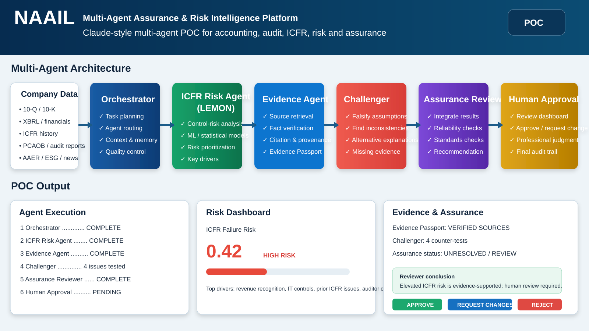

# NAAIL Multi-Agent Assurance & Risk Intelligence POC

GitHub-renderable architecture image for the multi-agent POC.

## POC flow

Company evidence → Orchestrator → LEMON ICFR Risk Agent → Evidence Agent → Challenger/Falsifier → Assurance Reviewer → Human Approval Gate.

This is a bounded research/startup POC. It provides risk intelligence and decision support; it does **not** issue an audit opinion or regulatory determination.

## Core design principles

- provider-neutral multi-agent orchestration
- evidence provenance and Evidence Passport
- explicit challenger/falsifier separation
- independent assurance review
- mandatory human approval
- expandable specialist modules for CAM/KAM, PCAOB, AAER/forensic, IFRS, ESG and cybersecurity
