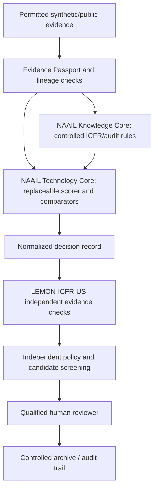

# Microsoft-Decision-1 × NAAIL OpenLab — Adoption and Research Plan

**Archive date:** 2026-10-10  
**Project:** NAAIL OpenLab / LEMON-ICFR-US / Microsoft-Decision-1  
**Status:** Controlled research pilot; not approved for production or audit conclusions.  
**Evidence standard:** Distinguish implemented software, reported CI, planned benchmarks, live-model validation and professional approval.

> This is a sanitized, public, version-controlled summary of a longer project-owner research/implementation archive. It does not contain private POMELO implementation, unpublished data, API keys, evaluator gold labels or confidential university/client data.

## 1. Adoption decision

**Proceed with a bounded, synthetic-first evaluation of Microsoft-Decision-1 as an optional and replaceable structured decision scorer.** It is not an audit evidence generator, a professional determination engine, or a source of production approvals.

The initial task is **ICFR control-risk triage** from an admissible evidence packet using four predefined alternatives: `HIGH`, `MODERATE`, `LOW` and `INSUFFICIENT`.

A high-risk triage label does **not** establish an ICFR material weakness; professional conclusions require independent review of risk, magnitude, likelihood, compensating controls, applicable standards and appropriate evidence.

## 2. Boundary-preserving architecture



- **Knowledge Core:** Controlled criteria, evidence requirements, assertions, provenance and escalation. Candidate AI cannot rewrite policy.
- **Technology Core:** Replaceable Decision-1 adapter, offline baseline, general-purpose LLM comparator and evaluation harness.
- **LEMON-ICFR-US:** Independent ICFR assurance-domain checks, contradiction review and retained Human Gate.
- **POMELO interface:** Conceptual, read-only policy screening. Proprietary code and private verification logic remain in their separate restricted environment.
- **Human authority:** Consequential decisions, including material-weakness, fraud and audit-reporting conclusions, remain with qualified reviewers.

## 3. Normalized decision record

The provider-neutral interface should record: case ID; task type; provider/model/version/deployment; evidence IDs and permission status; UTC time; prompt/configuration/candidate-state hashes; four fixed options; selected option; **nullable** probabilities; failure/abstention reason; token use, latency and cost when observed; and review queue.

Safety invariants:

```json
{
  "task_type": "ICFR_CONTROL_RISK_TRIAGE",
  "options": ["HIGH", "MODERATE", "LOW", "INSUFFICIENT"],
  "choice": "INSUFFICIENT",
  "probabilities": null,
  "approved": false,
  "human_gate": "AWAITING_HUMAN_APPROVAL",
  "production_action": null
}
```

This is a **schema illustration**, not a recorded response from the hosted model. Probabilities must stay null unless actually produced by an approved hosted provider, validated as numeric and compatible with the four-option specification. The offline rule arm must not fabricate model probabilities.

**Fail closed** on missing/duplicate evidence IDs, missing rights/provenance, gold-label leakage, contradictions, unapproved data transfer, bad response schema, provider/version mismatches, prompt injection, unauthorized actions, or unexpected model drift. Route affected cases to independent review and preserve error records.

## 4. Engineering and attack-test program

| Case | Required response |
| --- | --- |
| Complete ordinary synthetic case | Valid classification proposal; no autonomous approval |
| Deficient control case | Evidence-linked high/moderate routing may be proposed; human review mandatory |
| Missing or duplicated evidence | Error/abstain and independent review |
| Missing provenance or rights | Block before external transmission |
| Contradictory evidence | Escalate; do not silently resolve |
| Gold label in model input | Reject and log leakage |
| Invalid/missing choice or malformed probability vector | Reject response |
| High model confidence with weak evidence | Evidence sufficiency overrides confidence |
| Provider/model/version mismatch | Reject or suspend benchmark |
| Evidence prompt injection | Treat source content as evidence, never authority |
| Hosted API timeout/rate limit | Record failure; retain in denominator |
| Requested automatic release or approval | `approved=false`, `production_action=null` |
| Out-of-distribution or ambiguous case | Abstain or request human assessment |

The reported **18 synthetic cases** are engineering smoke tests, not a representative ICFR validation sample. Reproduce from an exact commit with Python version, dependency list, test count and logs, and preserve failed or skipped tests. A successful CI run does not demonstrate external model accuracy or audit validity.

## 5. AJPT research specification (prospective)

**Working title:** *Auditing Agentic AI: Specialized Decision Scoring, Evidence Verification, and Human Oversight in Internal Control Risk Assessment*

**Primary research question:** Does specialized structured scoring improve evidence-matched ICFR triage relative to general-purpose LLM scoring, without weakening independence, traceability and professional authority?

| Arm | Configuration | Research status |
| --- | --- | --- |
| A | Offline deterministic rules | Reported engineering baseline; independent reproduction required |
| B | Microsoft-Decision-1 hosted model | Adapter reported; live ICFR performance **untested** |
| C | General-purpose LLM on matched evidence | Proposed controlled comparator |
| D | Model + independent checks + human review | Proposed hybrid experiment |

**Pre-specified, falsifiable hypotheses:**

- **H1:** Specialist scoring improves blinded classification quality and reduces high-risk false negatives relative to an evidence-matched LLM comparator.
- **H2:** Specialist scoring reduces median/p95 latency and *cost per correctly triaged case*, including failure and review costs.
- **H3:** When legitimate probabilities exist, specialist scoring improves Brier/ECE, calibrated risk and risk–coverage performance.
- **H4:** Independent evidence verification plus mandatory human review reduces unsupported conclusions and unauthorized actions.
- **H5:** Effects vary with evidence completeness, contradiction, control domain, account risk, firm size and year.

**Measurement:** Macro-F1, per-class precision/recall, high-risk recall, false-negative rate, confusion matrix, conditional PR-AUC, abstention/coverage, referral rate, unparseable output, model cost, median/p95 latency, and unauthorized-action count. Only compute probabilistic calibration metrics where genuine, meaningful probabilities exist.

**Identification/reproducibility:** Keep evaluator Blind Gold separate from model inputs; secure independently adjudicated reference labels and inter-rater reliability; freeze prompts, cases and model versions; randomize case order; match admissible evidence across arms; use firm-grouped and chronological holdouts; include failures in all denominators; preregister primary outcomes, comparisons and exclusions; report uncertainty intervals, null and adverse results. Plan study power prospectively. A roughly 100–200-case independently reviewed pilot is a possible design stage, not a powered final sample.

**Public evidence strategy:** Consider SEC EDGAR/CompanyFacts/XBRL and lawful public ICFR/audit disclosures with CIK, accession number, fiscal period, original URI, date acquired, transformations and source-use rights. Proprietary or separately licensed datasets require authorization.

## 6. Readiness gates

**Permitted now:** Static review, synthetic offline tests, provider-neutral contract, threat model, reproducibility documentation and prospective scientific protocol.

**Blocked until separate review:** Live paid endpoint invocation; external transmission of confidential/unpublished data; using real firm records without rights/privacy checks; interpreting model probabilities as calibrated; using provisional triage as a material-weakness finding; autonomous release, merging to production or adjusting governance controls.

One sanctioned **synthetic** live request may be conducted only after provider endpoint/schema, model version, university permissions, region, retention, cost owner, token logging and spending limits are validated.

## 7. 30 / 60 / 90 day plan

| Horizon | Milestone | Exit criterion |
| --- | --- | --- |
| Days 1–30 | Freeze commit; reproduce offline harness; validate interface, rights, threat model and gold-leakage defenses | Full logs, zero unauthorized external calls, independent gate intact |
| Days 31–60 | Verify provider and, subject to authorization, execute one synthetic hosted call; freeze blinded protocol and comparators | Schema, costs, failures and versions observable; no automatic conclusion |
| Days 61–90 | Independent case labeling; four-arm pilot; uncertainty and robustness evaluation; AJPT prospective package | Supported empirical claims only; production remains separately gated |

## 8. Current claims and limitations

The public project [draft PR #152](https://github.com/Saehon/Saeid-Homayoun/pull/152) is a review artifact, **not** permission to merge. Its implementation and GitHub Actions must be evaluated from precise commit-specific readbacks before claiming reproduced success.

**No live Microsoft-Decision-1 ICFR accuracy, calibration, latency or cost result is asserted in this document. No professional audit approval is asserted.**

This public file is a research-plan mirror. The project owner's canonical archive, master index, complete original result, original master prompt and restricted verification records remain in the existing private Google Drive project folder. 
