# Saeid Homayoun

### Accounting × Finance × Economics × Data Science × Agentic AI

I build **evidence-grounded AI research systems for business science**—with a particular focus on accounting, auditing, finance, economics, sustainability, causal inference, reproducible empirical research, and multi-agent scientific discovery.

## NAAIL OpenLab™ — V2026.3 Multi-Agent Digital Twin

**NAAIL OpenLab™ is the flagship umbrella platform.** It is an evidence-governed multi-agent platform for accounting, auditing, economics, sustainability, forensic analytics, education, and reproducible scientific discovery.

**Specialist Agent Families:** **POMELO™ · KIWI™ · ECONOVA-S™ · ESG Intelligence · ICFR Intelligence · Forensic Intelligence**

**ECONOVA-S™** is the dedicated **Data Economy & Economic Intelligence Agent** within NAAIL OpenLab™, providing economic digital twins, asset-pricing research, financial-data analytics, LLM-based economic discovery, and reproducible empirical research workflows.

> **Models generate. Agents debate. Code tests. Evidence decides. Humans approve.**

[](https://github.com/Saehon/Saeid-Homayoun/actions/workflows/ai_to_ai_contract.yml)
[](https://github.com/Saehon/Saeid-Homayoun/actions/workflows/scientific_discovery_protocol.yml)
[](ARCHITECTURE.md)
[](NAAIL-OpenLab/versions/V2026.3_MULTI_AGENT_DIGITAL_TWIN.md)
[](NAAIL-OpenLab/README.md)
[](REPRODUCIBILITY.md)

---

## Canonical platform hierarchy

```text
NAAIL OpenLab™
V2026.3 Multi-Agent Digital Twin
│
├── NAAIL Scientific Discovery & Governance Layer
│   ├── AI Co-Scientist
│   ├── Hypothesis Generator / Critic / Ranker
│   ├── ERA Empirical Research Agent
│   ├── AlphaEvolve-style Model Evolution
│   ├── Computational Discovery
│   ├── Chain-of-Evidence
│   ├── Adversarial Review
│   ├── Reproducibility & Falsification
│   └── Human Approval Gate
│
├── Professional Digital-Twin Agents
│   ├── KIWI™ — Audit / CAM / KAM Intelligence
│   ├── POMELO™ — Accounting & Assurance Intelligence
│   ├── ESG / Sustainability Intelligence Agent
│   ├── ICFR & Controls Intelligence Agent
│   ├── Forensic Intelligence Agent
│   └── ECONOVA-S™ — Data Economy & Economic Intelligence Agent
│
├── Data & Evidence Layer
│   ├── SEC / EDGAR / XBRL
│   ├── PCAOB / AAER
│   ├── CAM / KAM
│   ├── Fama–French
│   ├── Damodaran
│   ├── ESG
│   ├── Corporate Financial Data
│   └── Open Research / Replication Repositories
│
└── Education & Simulation Layer
    ├── Student Digital Twins
    ├── Audit Simulations
    ├── Accounting Simulations
    ├── Economic Simulations
    ├── Big Four-style Agent Exercises
    └── Reproducible Research Laboratories
```

**Brand relationship:**  
**NAAIL OpenLab™ → master platform**  
**NAAIL Multi-Agent Digital Twin → core architecture**  
**ECONOVA-S™, KIWI™, POMELO™, ESG, ICFR, Forensic → specialist agent families**

[Canonical master hierarchy →](NAAIL-OpenLab/architecture/MASTER_PLATFORM_HIERARCHY.md)

---

## NAAIL V2026.3 architecture

The frozen next-generation NAAIL architecture combines provider-neutral multi-agent engineering with professional Digital Twins and reproducible scientific discovery.

**V2026.3 architecture:**

**Evidence / Rights Gate → Digital Twin → Agent Frameworks → A2A + MCP → GraphRAG → Co-Scientist → ERA → AlphaEvolve-style Search → AlphaFold-inspired Latent Structure → Computational Discovery → Critic / Defender / Replicator / Falsifier → Chain-of-Evidence → Professional Decision DAG™ → Human Gate.**

The architecture distinguishes reusable open-source foundations from optional managed cloud services. It is designed to benchmark advanced professional-services capability classes without copying proprietary Big Four systems, confidential workflows, client data, or protected code.

- **Architecture snapshot:** [NAAIL OpenLab V2026.3](NAAIL-OpenLab/versions/V2026.3_MULTI_AGENT_DIGITAL_TWIN.md)
- **Canonical hierarchy:** [Master Platform Hierarchy](NAAIL-OpenLab/architecture/MASTER_PLATFORM_HIERARCHY.md)
- **Scientific Discovery Contract:** [NAAIL Scientific Discovery Contract](NAAIL-OpenLab/SCIENTIFIC_DISCOVERY_CONTRACT.md)
- **Current validated executable release:** [NAAIL OpenLab v0.2.3 / Prototype 003](NAAIL-OpenLab/README.md)
- **Public Prototype 003 runtime:** [deterministic checkpoint + provider-required AI gates](NAAIL-OpenLab/Prototype_003/runtime/README.md)
- **Companion multi-agent engineering repository:** [Google-Antigravity-using-a-multi-agent-BERT-architecture](https://github.com/Saehon/Google-Antigravity-using-a-multi-agent-BERT-architecture)
- **Current project state:** [NAAIL OpenLab Current Project State](NAAIL-OpenLab/CURRENT_PROJECT_STATE.md)

Prototype 003 has a validated three-case synthetic deterministic benchmark. The registered single-agent, sequential-agent and governed multi-agent comparison conditions remain `NOT_EXECUTED_PROVIDER_REQUIRED` until real provider/model adapters are configured; NAAIL does not replace missing model runs with simulated AI outputs.

V2026.3 is an architecture target for the next implementation cycle; it does **not** imply that every component is already executable or validated.

---

## Specialist Agent: ECONOVA-S™ — Data Economy & Economic Intelligence

**ECONOVA-S™ is a specialist agent family within NAAIL OpenLab™**, not a separate competing umbrella platform.

Its scope includes:

- **Economic Digital Twin** — structured simulation and economic-state reasoning;
- **Data-Economy Agent** — data assets, information value, digital-economy research, and economic consequences of data;
- **Asset-Pricing Agent** — factor models, pricing tests, risk premia, model comparison, and robustness;
- **Fama–French Research Agent** — factor libraries, archive-vintage analysis, factor construction, and replication;
- **Damodaran Data Agent** — valuation, industry beta, risk, cost of capital, growth, and profitability evidence;
- **SEC / XBRL Economic Evidence Agent** — chronology-aware firm fundamentals and filing evidence;
- **LLM Economic Research Agent** — governed textual measurement and economic discovery;
- **Multi-Agent Hypothesis Discovery** — competing mechanisms, critique, ranking, and falsification;
- **FT50 / Management Science Research Engine** — reproducible empirical designs, model evolution, robustness, replication, and publication-grade evidence.

ECONOVA-S inherits the common NAAIL scientific-governance layer rather than maintaining a separate scientific constitution.

### Canonical discovery workflow

```mermaid
flowchart LR
    A[Research Question] --> B[FT50 / AJG Literature]
    B --> C[Co-Scientist Hypothesis Arena]
    C --> D[Theory + DAG Governance]
    D --> E[ERA Empirical Object]
    E --> F[Real Data + Code]
    F --> G[ResearchEvolve / Computational Discovery]
    G --> H[Latent-Structure Validation]
    H --> I[Replication + OOS]
    I --> J[AI-to-AI Adversarial Review]
    J --> K[Falsification]
    K --> L[Science One Chain-of-Evidence]
    L --> M[Evidence Passport]
    M --> N{Human Gate}
```



**Scientific invariant:** statistical significance, agent consensus, model confidence, or predictive accuracy alone is never sufficient for a discovery claim.

[Read the canonical protocol →](GOOGLE_INSPIRED_DISCOVERY_PROTOCOL.md)

---

## Specialist agent families

| NAAIL agent family | Primary role | Example evidence / data |
|---|---|---|
| **POMELO™** | Accounting, assurance, professional intelligence, standards-aware reasoning and evidence verification | IFRS/assurance evidence, accounting research, professional guidance |
| **KIWI™** | Audit, CAM/KAM, audit evidence, assertions, risk–procedure alignment and audit-quality measurement | CAM/KAM, SEC, PCAOB, audit evidence |
| **ECONOVA-S™** | Data economy, economics, finance, asset pricing and economic digital twins | Fama–French, Damodaran, SEC/XBRL, market/economic data |
| **ESG Intelligence** | Sustainability reporting, ESG measurement, materiality, sustainable value and assurance | ESG/public reporting, sustainability standards and market data |
| **ICFR Intelligence** | Internal controls, material weaknesses, remediation, controls testing and risk forecasting | SEC CompanyFacts, ICFR disclosures, controls evidence |
| **Forensic Intelligence** | Fraud risk, anomalies, investigative analytics and forensic evidence graphs | AAER/regulatory evidence, transactional and synthetic forensic data |

---

## Original NAAIL public products

These are the primary original research repositories to use when evaluating this portfolio.

| Repository | Role | Maturity |
|---|---|---|
| **[Saeid-Homayoun](https://github.com/Saehon/Saeid-Homayoun)** | Flagship NAAIL OpenLab™ hub: master architecture, scientific governance, specialist-agent integration, reproducibility, AI-to-AI orchestration, and empirical studies | Research Prototype / flagship hub |
| **[AAA](https://github.com/Saehon/AAA)** | Audit analytics, accounting/auditing AI, notebooks, empirical prototypes and research tooling | Research Laboratory / Research Prototype |
| **[IFRS-AI-Inspector](https://github.com/Saehon/IFRS-AI-Inspector)** | Standards-aware IFRS assurance and financial-reporting digital-twin research supporting the POMELO family | Research Prototype |
| **[Multi-Agent Accounting AI Framework](https://github.com/Saehon/Google-Antigravity-using-a-multi-agent-BERT-architecture)** | Companion V2026.3 engineering repository for multi-agent orchestration, BERT/NLP, A2A/MCP, GraphRAG, evidence governance and professional Digital Twins | Research Prototype |

### Private / IP-sensitive R&D

- **POMELO™ / POMELO VERA™** — proprietary professional-intelligence, verification, evidence, benchmark, and governance R&D in `Saehon/pomelo-core`.
- **PCAOB Inspection Agent** — private evidence-linked inspection and remediation research in `Saehon/IFRS-PCAOB-AI`.

### Upstream / reference / integration repositories

Repositories such as **[timesfm](https://github.com/Saehon/timesfm)**, `yfinance`, financial-NLP references, synthetic-data projects, and other upstream/imported repositories are used for **integration, replication, benchmarking, experimentation, or teaching**. They are not presented as original NAAIL inventions. In particular, `Saehon/timesfm` is a fork/reference of Google Research TimesFM.

[Full product portfolio and maturity matrix →](PRODUCT_PORTFOLIO.md) · [NAAIL repository standard →](NAAIL_PRODUCT_STANDARD.md) · [Third-party notices →](THIRD_PARTY_NOTICES.md)

---

## Flagship empirical study

### MNSc–FamaFrench–01
**When Data Construction Changes Asset Pricing: The FIZ–CIZ Transition and the Stability of Fama–French Factors**

This study is an **ECONOVA-S™ specialist-agent research project within NAAIL OpenLab™**. It uses official Kenneth R. French historical archive snapshots to test whether a data-construction change can alter asset-pricing conclusions. The official Kenneth R. French Data Library notes that CRSP's Legacy Format (FIZ) files were discontinued after the December 2024 release and that the new format begins with the January 2025 release.

Current research objects include:

- Data Construction Sensitivity (DCS);
- CAPM / FF3 / FF5 comparison;
- HAC / Newey–West inference;
- conclusion-reversal analysis;
- temporal and subperiod robustness;
- source SHA-256 fingerprints;
- pre-analysis protocol;
- Evidence Passport™;
- explicit pre-discovery status until replication, adversarial review, falsification, Chain-of-Evidence, and Human Gate are complete.

[Open the study →](studies/MNSc-FamaFrench-01/)

### Research evidence anchors

| Research element | Primary citation / source |
|---|---|
| **FIZ → CIZ transition and archive vintages** | [Kenneth R. French Data Library — Changes in CRSP Data](https://mba.tuck.dartmouth.edu/pages/faculty/ken.french/data_library.html) |
| **FF3 specification** | Fama, E. F., & French, K. R. (1993), *Common risk factors in the returns on stocks and bonds*, **Journal of Financial Economics, 33(1), 3–56**. [DOI](https://doi.org/10.1016/0304-405X(93)90023-5) |
| **FF5 specification** | Fama, E. F., & French, K. R. (2015), *A five-factor asset pricing model*, **Journal of Financial Economics, 116(1), 1–22**. [DOI](https://doi.org/10.1016/j.jfineco.2014.10.010) |
| **HAC / Newey–West inference** | Newey, W. K., & West, K. D. (1987), *A simple, positive semi-definite, heteroskedasticity and autocorrelation consistent covariance matrix*, **Econometrica, 55(3), 703–708**. [DOI](https://doi.org/10.2307/1913610) |
| **BH-FDR multiple-testing control** | Benjamini, Y., & Hochberg, Y. (1995), *Controlling the false discovery rate: A practical and powerful approach to multiple testing*, **JRSS Series B, 57(1), 289–300**. [DOI](https://doi.org/10.1111/j.2517-6161.1995.tb02031.x) |

These anchors define the study's source and method lineage. They do **not** by themselves establish that the observed July-2024 versus July-2025 archive differences are caused solely by the FIZ→CIZ transition; the study's attribution firewall remains in force.

---

## NAAIL scientific contract

Every publication-grade NAAIL study—whether executed through ECONOVA-S™, KIWI™, POMELO™, ESG, ICFR, or Forensic Intelligence—must pass the applicable common scientific gates:

**literature validation → hypothesis competition → construct validation → data provenance → identification → executable empirical design → robustness → temporal/OOS validation → multiple-testing control → adversarial review → falsification → independent replication → Chain-of-Evidence → CoE Audit → Human Gate**

Key rules:

```text
agent_consensus_is_scientific_truth = false
optimize_for_p_value = false
human_gate_required = true
discovery_claim_allowed = false   # default
```

A failed hypothesis, rejected specification, data-mapping problem, or replication failure is retained in **Failure Memory™** rather than deleted from the scientific record.

[Scientific Discovery Contract →](NAAIL-OpenLab/SCIENTIFIC_DISCOVERY_CONTRACT.md)

---

## Platform architecture

NAAIL OpenLab™ separates durable professional/scientific meaning from replaceable technology.

### 1. Stable Knowledge Core™

Accounting · Auditing · Assurance · Finance · Economics · Sustainability · Data Economy · Forensics · ICFR · Theory · Causal DAGs · Variable DNA™ · Econometrics · Identification · Replication · Falsification · Chain-of-Evidence · Professional judgment

### 2. Replaceable Technology Core™

LLMs · Agent runtimes · RAG / GraphRAG · Python · R · Stata · ML · foundation models · model routers · databases · evaluators · compute

The **Scientific Intelligence Fabric™** connects them; it is an orchestration layer, not a third independent platform.

> Technology can change. Scientific evidence requirements cannot silently change with it.

[Architecture →](ARCHITECTURE.md) · [Scientific assurance →](SCIENTIFIC_ASSURANCE.md) · [Reproducibility →](REPRODUCIBILITY.md) · [Data provenance →](DATA_SOURCES.md)

---

## Public-data research policy

Primary data should come from authoritative providers whenever available.

| Source | Primary use |
|---|---|
| **Kenneth R. French Data Library** | factors, portfolios, asset-pricing archives |
| **Aswath Damodaran / NYU Stern** | industry beta, cost of capital, valuation, profitability, growth |
| **SEC EDGAR / XBRL CompanyFacts** | chronology-aware firm fundamentals and filings |
| **PCAOB / other regulators** | audit and inspection research where publicly available |

GitHub and Kaggle can support replication, benchmarking, or examples, but should not silently replace the authoritative source.

---

## Technical capabilities

`Python` · `R` · `Stata` · `Econometrics` · `Panel Data` · `DiD` · `DML` · `Time Series` · `NLP` · `BERT / FinBERT` · `LLMs` · `RAG / GraphRAG` · `Knowledge Graphs` · `Multi-Agent Systems` · `Scientific Evaluation` · `Reproducible Research`

---

## For research collaborators and AI teams

I am particularly interested in collaborations at the intersection of:

- **AI for scientific discovery**;
- **agentic research systems**;
- **accounting and audit intelligence**;
- **financial/economic data science**;
- **LLM-based empirical measurement**;
- **causal and computational discovery**;
- **verifiable AI / Chain-of-Evidence**;
- **AI evaluation for high-stakes professional research**.

The objective is not to automate paper writing. It is to build AI systems that can **propose, test, challenge, reproduce, and document scientific claims** under explicit governance.

---

## Research identity

**Saeid Homayoun**  
Accounting researcher · Data/AI researcher · University of Gävle, Sweden  
ORCID: [0000-0002-2536-0446](https://orcid.org/0000-0002-2536-0446)

---

## Citation, licensing, and independence

Use the repository citation metadata for NAAIL OpenLab™ and its specialist research families. Individual studies may also provide study-specific citation metadata.

Research and permitted non-commercial use are governed by [`LICENSE`](LICENSE). Commercial use is governed separately by [`COMMERCIAL_LICENSE.md`](COMMERCIAL_LICENSE.md) and [`IP_NOTICE.md`](IP_NOTICE.md).

**NAAIL OpenLab™ is an independent research initiative.** POMELO™, KIWI™, ECONOVA-S™, ESG Intelligence, ICFR Intelligence, and Forensic Intelligence are NAAIL specialist research/agent families. References to OpenAI, Google, Google Research, Google DeepMind, Microsoft, Mirendil, Big Four firms, or other organizations identify methodological inspiration, model providers, public research systems, comparison targets, or interoperability references only and do not imply sponsorship, employment, endorsement, partnership, certification, or organizational affiliation unless explicitly documented.