# ECONOVA-S™

### Governed AI-to-AI Scientific Economic Intelligence
**Data Economy · Finance · Sustainable Welfare · GPT-5.6 Sol Reasoning · Co-Scientist · ERA · Computational Discovery**

[](https://github.com/Saehon/Saeid-Homayoun/actions/workflows/ai_to_ai_contract.yml)
[](https://github.com/Saehon/Saeid-Homayoun/actions/workflows/scientific_discovery_protocol.yml)
[](prototype_v02/)
[](ARCHITECTURE.md)

ECONOVA-S™ is an independent, governed research-software platform for **AI-assisted scientific discovery in economics and finance**. In supported prototype workflows, **GPT-5.6 Sol serves as the current high-reasoning backend inside the Replaceable Technology Core™** for hypothesis generation, empirical-design critique, scientific red-teaming, evidence synthesis, and structured agent-to-agent reasoning.

GPT-5.6 Sol is deliberately **not** the scientific authority. ECONOVA-S™ separates model intelligence from scientific acceptance: economic theory, causal DAGs, provenance, identification, replication, falsification, Chain-of-Evidence, welfare interpretation, and the Human Gate™ remain governed independently of the model backend.

> **GPT-5.6 Sol reasons. ECONOVA-S™ governs. Evidence decides. Humans approve.**

## Status

| Layer | Status |
|---|---|
| Canonical architecture | **V2.5** |
| Latest citable software | **v0.2.0** |
| Active development | **v0.3** |
| Current high-reasoning backend | **GPT-5.6 Sol — replaceable** |
| AI-to-AI automation | **Runnable deterministic orchestration + governance tests** |
| Scientific discovery protocol | **Machine-readable study manifest + gate validator** |
| Flagship empirical study | **MNSc–FamaFrench–01: FIZ→CIZ transition** |
| Scientific claim gate | `discovery_claim_allowed = false` |

**Maintainer:** Saeid Homayoun  
**ORCID:** [0000-0002-2536-0446](https://orcid.org/0000-0002-2536-0446)

---

## Research question

> **When does data become information, and when does information become economic and social value?**

ECONOVA-S™ separates stable scientific meaning from replaceable technology:

1. **Stable Economic Knowledge Core™** — economics, finance, data economy, causal DAGs, Variable DNA™, identification, replication, falsification, sustainability, Chain-of-Evidence, and welfare.
2. **Replaceable Technology Core™** — GPT-5.6 Sol and future LLMs, retrieval, Python/R/Stata/EViews, databases, evaluators, model routers, tool protocols, and compute.

The **AI-to-AI Scientific Intelligence Fabric™** connects the two cores; it is not a third core.

[Canonical architecture →](ARCHITECTURE.md)

---

# Scientific Discovery Stack

ECONOVA-S™ now formalizes a single publication-grade discovery sequence inspired by current Google Research / Google DeepMind scientific-AI systems and adjacent autonomous-R&D work.

```mermaid
flowchart LR
    A[Research Goal] --> B[Literature Grounding]
    B --> C[Co-Scientist Hypothesis Tournament]
    C --> D[DAG / Systems Governance]
    D --> E[ERA Empirical Conversion]
    E --> F[AlphaEvolve / Computational Discovery]
    F --> G[Latent-Structure Analysis]
    G --> H[Independent Replication]
    H --> I[AI-to-AI Red-Team]
    I --> J[Science One Chain-of-Evidence]
    J --> K[CoE Audit]
    K --> L[Falsification]
    L --> M[Welfare Interpretation]
    M --> N[Evidence Passport™]
    N --> O{Human Gate™}
```



## Methodological mapping

| Layer | ECONOVA-S™ implementation |
|---|---|
| **AI Co-Scientist-style** | Generation → Reflection → Ranking → Evolution → Proximity → Meta-review hypothesis tournament |
| **ERA-style** | Converts hypotheses into real data, Variable DNA™, executable code, estimands, metrics, robustness and replication tests |
| **AlphaEvolve-inspired** | Evolves algorithms, measures, estimators, prompts and specifications against frozen scientific fitness |
| **Computational Discovery** | Parallel candidate generation/evaluation with lineage, immutable evaluator outputs and exploration/exploitation control |
| **AlphaFold-inspired** | Searches latent economic structures such as factors, regimes, networks and hidden mechanisms; requires interpretation + validation |
| **Science One-inspired** | Chain-of-Evidence for claim completeness/correctness plus CoE Audit |
| **Mirendil-inspired** | Closed-loop R&D improvement with observability and evaluation, but no authority to weaken scientific gates |
| **AI-to-AI review** | Independent replicator + adversarial critic + explicit independence class |
| **DAG governance** | Evidence class and identification logic constrained by explicit causal/system structure |
| **GPT-5.6 Sol** | Replaceable high-reasoning backend for generation, critique, synthesis and red-team workflows; never the final scientific gate |

The full canonical protocol is in [`GOOGLE_INSPIRED_DISCOVERY_PROTOCOL.md`](GOOGLE_INSPIRED_DISCOVERY_PROTOCOL.md).

### Non-bypassable scientific invariants

```text
agent_consensus_is_scientific_truth = false
human_gate_required = true
human_gate_approved = false   # default
discovery_claim_allowed = false
```

External names such as AI co-scientist, ERA, AlphaEvolve, Computational Discovery, AlphaFold, Science One, and Mirendil describe **methodological inspiration unless the corresponding external system is actually executed and recorded in the Evidence Passport™**.

---

# AI-to-AI Scientific Automation™

The repository contains a **runnable, vendor-neutral orchestration layer**. It does not treat one model reviewing its own answer as independent scientific validation.

Each agent handoff records:

`TaskID · RunID · Sender · Receiver · Claim · Evidence · Method · Assumptions · Confidence · Contradictions · FailureStatus · Provenance · ParentHash · IndependenceClass · RiskFlags · RequiredNextAction · ContentSHA256`

Each handoff is SHA-256 hashed and linked to the previous handoff. Blocking failures stop or reroute the pipeline rather than being silently converted into success.

### Run the offline automation demo

```bash
python automation/orchestrator.py \
  --question "When does data become information and economic value?" \
  --output automation/artifacts/demo_chain.json
```

### Validate the scientific-discovery manifest

```bash
python discovery/validate_study_manifest.py discovery/sample_study_manifest.json
python -m pytest -q discovery/test_discovery_manifest.py
```

The current sample is intentionally valid while preserving:

```text
discovery_claim_allowed = false
```

### Core governance resources

- [`AI_TO_AI_AUTOMATION.md`](AI_TO_AI_AUTOMATION.md) — agent automation and routing;
- [`GOOGLE_INSPIRED_DISCOVERY_PROTOCOL.md`](GOOGLE_INSPIRED_DISCOVERY_PROTOCOL.md) — canonical discovery protocol;
- [`SCIENTIFIC_ASSURANCE.md`](SCIENTIFIC_ASSURANCE.md) — scientific claim gates;
- [`REPRODUCIBILITY.md`](REPRODUCIBILITY.md) — reproducibility contract;
- [`discovery/study_manifest.schema.json`](discovery/study_manifest.schema.json) — machine-readable study contract;
- [`discovery/validate_study_manifest.py`](discovery/validate_study_manifest.py) — discovery gate validator;
- [`templates/STUDY_DISCOVERY_TEMPLATE.md`](templates/STUDY_DISCOVERY_TEMPLATE.md) — publication-grade study template;
- [`.github/workflows/scientific_discovery_protocol.yml`](.github/workflows/scientific_discovery_protocol.yml) — zero-secret protocol CI.

> **Engineering rule: automate execution, not scientific authority.**

---

## What is implemented

The public repository includes:

- formal AI-to-AI handoff/provenance contract;
- chained SHA-256 integrity and final run hash;
- runnable deterministic orchestration;
- GPT-5.6 Sol as the current replaceable high-reasoning backend in supported prototype workflows;
- Co-Scientist-style hypothesis functions;
- ERA-style hypothesis-to-empirical conversion rules;
- AlphaEvolve-inspired scientific search governance;
- Computational Discovery candidate-lineage rules;
- AlphaFold-inspired latent-structure validation rules;
- Science One-inspired Chain-of-Evidence and CoE Audit requirements;
- Mirendil-inspired closed-loop R&D containment boundary;
- machine-enforced discovery manifest;
- independent-replicator and scientific-red-team roles;
- explicit independence classification;
- risk flags and scientific stop conditions;
- failure propagation and fault containment;
- Evidence Passport™ and Human Gate™ controls;
- evidence-grounded metadata RAG;
- official Fama–French data adapters;
- Damodaran / NYU Stern industry-data adapters;
- SEC EDGAR XBRL CompanyFacts ingestion with chronology safeguards;
- six-table empirical reporting;
- fixed-effects and clustered/HC3 inference where specified;
- temporal/out-of-sample checks;
- Stata `.do` export.

The scientific contract is provider-neutral. GPT-5.6 Sol can be upgraded or replaced by future OpenAI, Google/Gemini, Microsoft/Azure, local, or other model backends without changing the Stable Economic Knowledge Core™ or scientific gates.

---

# Flagship v0.3 real-data study

## MNSc–FamaFrench–01
### *When Data Construction Changes Asset Pricing: The FIZ–CIZ Transition and the Stability of Fama–French Factors*

The first frozen empirical study compares official Kenneth R. French historical archive snapshots across the CRSP **FIZ → CIZ** return-construction transition.

It implements:

- Data Construction Sensitivity (DCS);
- HAC/Newey–West factor-premium inference;
- CAPM, FF3, and FF5 alpha comparison;
- sign/significance Conclusion Reversal detection;
- subperiod robustness;
- six publication-style tables;
- source SHA-256 fingerprints;
- frozen pre-analysis protocol;
- offline archive reproduction path;
- Evidence Passport output.

[Study folder →](studies/MNSc-FamaFrench-01/)  
[Validation PR →](https://github.com/Saehon/Saeid-Homayoun/pull/9)

The canonical discovery manifest for this study currently remains **pre-discovery** because replication, adversarial review, falsification, Chain-of-Evidence, CoE Audit and final Human Gate are not yet complete.

---

## Scientific assurance

ECONOVA-S™ does **not** treat novelty, statistical significance, predictive accuracy, evaluator score, GPT-5.6 Sol confidence, or multi-agent agreement as sufficient evidence of discovery.

A serious claim must survive the applicable gates for:

**literature validation → hypothesis tournament → DAG governance → construct validity → ERA empirical conversion → provenance/chronology → identification → search integrity → latent-structure validation when used → replication/OOS → AI-to-AI adversarial review → falsification → Chain-of-Evidence → CoE Audit → economic significance → welfare interpretation → reproducibility → Human Gate**

[Scientific Assurance Standard →](SCIENTIFIC_ASSURANCE.md)

---

## Authoritative public-data policy

| Source | Role |
|---|---|
| Kenneth R. French Data Library | factors, portfolios, historical archives |
| SEC EDGAR / XBRL CompanyFacts | chronology-aware firm fundamentals |
| Aswath Damodaran / NYU Stern | industry valuation and cost-of-capital benchmarks |
| Climate TRACE / verified user data | climate/emissions extensions |

GitHub and Kaggle can be used for replication examples or mirrors, but should not silently replace an available authoritative source.

[Data provenance policy →](DATA_SOURCES.md)

---

## Repository map

```text
README.md                               Project front door
ARCHITECTURE.md                         Canonical V2.5 architecture
GOOGLE_INSPIRED_DISCOVERY_PROTOCOL.md   Canonical scientific-discovery protocol
AI_TO_AI_AUTOMATION.md                  Multi-agent scientific automation
SCIENTIFIC_ASSURANCE.md                 Scientific claim gates
REPRODUCIBILITY.md                      Reproducibility + Chain-of-Evidence contract
DATA_SOURCES.md                         Data/provenance policy
automation/orchestrator.py              Runnable AI-to-AI runtime
automation/ai_handoff.schema.json       Scientific handoff contract
discovery/study_manifest.schema.json    Study-level discovery contract
discovery/validate_study_manifest.py    Machine discovery-gate validator
templates/STUDY_DISCOVERY_TEMPLATE.md   Publication-grade study template
prototype_v02/                          GPT-5.6 Sol real-data + evidence-RAG workbench
prototype_v03/                          Official public-data ingestion layer
studies/MNSc-FamaFrench-01/             First frozen empirical study
.github/                                CI, governance, issue and PR templates
```

---

## Citation and license

Use [`CITATION.cff`](CITATION.cff) to cite ECONOVA-S™.

Canonical Architecture **V2.5** and citable software **v0.2.0** are separate version tracks; v0.3 remains active development until formally released.

Research and permitted non-commercial use are governed by [`LICENSE`](LICENSE). Commercial products, SaaS/API services, client delivery, for-profit internal deployment, or other commercial exploitation require prior written permission. See [`COMMERCIAL_LICENSE.md`](COMMERCIAL_LICENSE.md) and [`IP_NOTICE.md`](IP_NOTICE.md).

---

## Independence

ECONOVA-S™ is an **independent research project**. References to GPT-5.6 Sol, OpenAI, Google, Google Research, Google DeepMind, Microsoft, Mirendil, Azure, or other organizations and technologies identify methodological inspiration, model providers, public research systems, or interoperability targets only; they do not imply sponsorship, employment, endorsement, partnership, or organizational affiliation unless explicitly documented.
