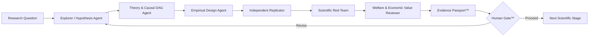

# ECONOVA-S™

### Governed AI-to-AI scientific economic intelligence for data economy, finance, and sustainable welfare research

[](https://github.com/Saehon/Saeid-Homayoun/actions/workflows/ai_to_ai_contract.yml)

ECONOVA-S™ is an independent research-software platform for **AI-assisted scientific discovery with explicit economic theory, real-data provenance, econometric identification, AI-to-AI adversarial review, replication, falsification, and human scientific governance**.

> **AI explores. Economics constrains. Agents challenge. Evidence verifies. Humans approve.**

## Project status

| Layer | Status |
|---|---|
| Canonical architecture | **V2.5** |
| Latest citable software version | **v0.2.0** |
| Active development | **v0.3 — official public data + first real empirical study** |
| AI-to-AI automation | **Machine-readable contract + CI validation** |
| Flagship real-data study | **MNSc–FamaFrench–01: FIZ→CIZ measurement transition** |
| Scientific claim status | `discovery_claim_allowed = false` |

**Maintainer:** Saeid Homayoun  
**ORCID:** [0000-0002-2536-0446](https://orcid.org/0000-0002-2536-0446)

---

## Why ECONOVA-S?

Modern AI can generate hypotheses, search large design spaces, write code, and coordinate specialized agents. Scientific research, however, requires more than model capability. ECONOVA-S separates **stable scientific meaning** from **replaceable technology** and inserts explicit verification gates between AI generation and scientific claims.

The central question is:

> **When does data become information, and when does information become economic and social value?**

ECONOVA-S is designed around exactly two permanent cores:

1. **Stable Economic Knowledge Core™** — theory, causal DAGs, Variable DNA™, identification, replication, welfare, and scientific acceptance criteria.
2. **Replaceable Technology Core™** — LLMs, retrieval, Python/R/Stata/EViews, databases, tools, model routers, and emerging AI infrastructure.

A supporting **AI-to-AI Scientific Intelligence Fabric™** connects the two cores. It is **not a third core**.

[Read the canonical architecture →](ARCHITECTURE.md)

---

## AI-to-AI Scientific Automation™

ECONOVA-S does not rely on a single model reviewing its own answer. Scientific work is decomposed into explicit roles with machine-readable handoffs, provenance, failure propagation, and stop conditions.



### Agent-to-agent contract

Every scientific handoff carries:

`TaskID · RunID · Sender · Receiver · Claim · Evidence · Method · Assumptions · Confidence · Contradictions · FailureStatus · Provenance · RequiredNextAction · ContentSHA256`

This makes disagreements and failures traceable rather than silently averaged away.

**Key rule:**

`agent_consensus != scientific_truth`

A second AI response is not automatically an independent replication. Independence should be strengthened through separate model families, isolated context, independent code/data execution, frozen protocols, blinded benchmarks, or external human review.

The repository now includes:

- [`AI_TO_AI_AUTOMATION.md`](AI_TO_AI_AUTOMATION.md) — canonical automation architecture and stop rules;
- [`automation/ai_handoff.schema.json`](automation/ai_handoff.schema.json) — machine-readable handoff schema;
- [`automation/sample_handoff.json`](automation/sample_handoff.json) — auditable example handoff;
- [`automation/validate_handoff.py`](automation/validate_handoff.py) — schema/hash validator;
- [`.github/workflows/ai_to_ai_contract.yml`](.github/workflows/ai_to_ai_contract.yml) — zero-secret CI validation.

The automation layer remains vendor-neutral. GPT/OpenAI, Microsoft, Google, local models, or future systems may be used as replaceable implementations without changing the scientific contract.

[Read the AI-to-AI automation standard →](AI_TO_AI_AUTOMATION.md)

---

## What is implemented now

The public repository currently includes:

- GPT-5.6 Sol as a **replaceable** model backend in supported deployments;
- Co-Scientist-style hypothesis generation and critique;
- ERA-style empirical conversion;
- AlphaEvolve-inspired scientific specification search;
- evidence-grounded metadata RAG;
- formal AI-to-AI handoff and provenance contract;
- independent replicator and scientific red-team roles at the architecture level;
- real-data ingestion and provenance controls;
- official **Fama–French** data adapters;
- official **Damodaran / NYU Stern** industry-data adapters;
- **SEC EDGAR XBRL CompanyFacts** ingestion with filing-date chronology safeguards;
- six-table econometric reporting;
- fixed-effects and clustered/HC3 inference where specified;
- temporal/out-of-sample checks;
- Stata `.do` export;
- Evidence Passport™;
- explicit Human Gate™.

See the [Research Software Card](RESEARCH_SOFTWARE_CARD.md) for intended use, limitations, and governance.

---

## Flagship v0.3 real-data study

### MNSc–FamaFrench–01
**When Data Construction Changes Asset Pricing: The FIZ–CIZ Transition and the Stability of Fama–French Factors**

The study compares official Kenneth R. French historical archive snapshots across the CRSP **FIZ → CIZ** return-construction transition using a common monthly sample.

It implements:

- **Data Construction Sensitivity (DCS)**;
- factor-premium stability with HAC/Newey–West inference;
- CAPM, FF3, and FF5 alpha comparison;
- sign/significance **Conclusion Reversal** detection;
- subperiod robustness;
- six publication-style output tables;
- source SHA-256 fingerprints;
- frozen pre-analysis protocol;
- offline archive reproduction path;
- `RUN_SUMMARY.md`;
- `evidence_passport.json`.

[Open the study →](studies/MNSc-FamaFrench-01/)  
[Run engine →](studies/MNSc-FamaFrench-01/run_study.py)  
[Validation PR →](https://github.com/Saehon/Saeid-Homayoun/pull/9)

### Run locally

```bash
git clone https://github.com/Saehon/Saeid-Homayoun.git
cd Saeid-Homayoun/studies/MNSc-FamaFrench-01

python -m venv .venv
# Windows
.venv\Scripts\activate
# macOS/Linux
# source .venv/bin/activate

pip install -r requirements.txt
pytest -q
python run_study.py --old 2024 --new 2025 --output artifacts
```

Expected artifacts include Tables 1–6, DCS measures, alpha comparisons, Conclusion Reversal flags, source hashes, and an Evidence Passport.

---

## Canonical scientific workflow

```text
Economic Question
→ Systems Map / Causal DAG
→ Top-journal Evidence Prior
→ Competing Hypothesis Tournament
→ Replicate Known Fact
→ ERA-style Empirical Design
→ Variable DNA™
→ Real Data + Provenance
→ Econometrics / Experimentation
→ Independent Replicator
→ Scientific Red Team
→ OOS / Falsification
→ Economic Magnitude
→ Welfare Interpretation
→ Evidence Passport™
→ Human Gate™
```

References to Co-Scientist, AlphaEvolve, AlphaFold/DeepMind Science, Mirendil, and related systems describe **architectural inspiration unless the external system is actually executed**.

---

## Scientific assurance

ECONOVA-S does **not** treat novelty, statistical significance, predictive accuracy, LLM confidence, or AI-agent consensus as sufficient evidence of scientific discovery.

Every serious claim is expected to pass the applicable gates for:

- literature validity;
- construct/measurement validity;
- data provenance;
- identification;
- chronology/leakage control;
- independent replication or OOS validation;
- robustness and falsification;
- adversarial contradiction resolution;
- economic significance;
- welfare interpretation;
- explicit human approval.

[Read the Scientific Assurance Standard →](SCIENTIFIC_ASSURANCE.md)

---

## Data-source policy

ECONOVA-S prefers **authoritative primary sources** over mirrors.

| Source | Primary role |
|---|---|
| Kenneth R. French Data Library | factor structure, asset-pricing portfolios, historical archives |
| SEC EDGAR / XBRL CompanyFacts | chronology-aware firm fundamentals |
| Aswath Damodaran / NYU Stern | industry valuation, growth, and cost-of-capital benchmarks |
| Climate TRACE / verified user data | climate and emissions extensions |

GitHub and Kaggle may be used for replication examples or frozen mirrors, but should not silently replace an available authoritative source.

[Read the data-source and provenance policy →](DATA_SOURCES.md)

---

## Repository map

```text
README.md                         Project landing page
ARCHITECTURE.md                   Canonical V2.5 scientific architecture
AI_TO_AI_AUTOMATION.md            Multi-agent automation and governance
SCIENTIFIC_ASSURANCE.md           Claim classes and scientific gates
RESEARCH_SOFTWARE_CARD.md         Intended use, limitations and governance
REPRODUCIBILITY.md                Reproducibility contract
DATA_SOURCES.md                   Authoritative data/provenance policy
PROJECT_STATUS.md                 Current implementation status
ROADMAP.md                        Software and science roadmap
CITATION.cff                      Machine-readable citation metadata
LICENSE                           Research/non-commercial license
automation/                       AI-to-AI handoff schema and validator
prototype/                        v0.1 GPT-backed prototype
prototype_v02/                    v0.2 real-data + evidence-RAG workbench
prototype_v03/                    v0.3 official public-data ingestion layer
studies/MNSc-FamaFrench-01/       First frozen real-data empirical study
.github/                          CI, issue forms, PR template and ownership
```

---

## Citation

If you use or build on ECONOVA-S™, cite the repository using [`CITATION.cff`](CITATION.cff).

**Software versioning note:** Canonical Architecture **V2.5** and software release **v0.2.0** are separate version tracks. v0.3 is active development until formally released.

---

## License and commercial use

This repository is available for research, teaching, personal study, and permitted non-commercial experimentation under the repository license. Commercial products, SaaS/API services, client delivery, for-profit internal deployment, or other commercial exploitation require prior written permission.

See [`LICENSE`](LICENSE), [`COMMERCIAL_LICENSE.md`](COMMERCIAL_LICENSE.md), [`IP_NOTICE.md`](IP_NOTICE.md), and [`TRADEMARK_NOTICE.md`](TRADEMARK_NOTICE.md).

---

## Independence

ECONOVA-S™ is an **independent research project**. References to OpenAI, Microsoft, Google, DeepMind, or other organizations, models, and research systems identify technologies, inspiration, or interoperability targets only and do not imply sponsorship, endorsement, employment, or organizational affiliation unless explicitly documented.

---

## Current priority

The immediate research priority is to complete and archive the official **FIZ→CIZ real-data run**, then extend the study with reduced-rank factor-dimension analysis, multiplicity/FDR reliability analysis, independent replication, and chronology-safe SEC/Damodaran firm-level extensions.
