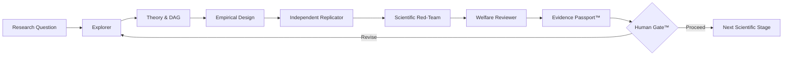

# ECONOVA-S™

### Governed AI-to-AI scientific economic intelligence for data economy, finance, and sustainable welfare research

[](https://github.com/Saehon/Saeid-Homayoun/actions/workflows/ai_to_ai_contract.yml)

ECONOVA-S™ is an independent research-software platform for **AI-assisted scientific discovery with explicit economic theory, real-data provenance, econometric identification, independent replication, adversarial review, failure containment, and human scientific governance**.

> **AI explores. Economics constrains. Agents challenge. Evidence verifies. Humans approve.**

## Status

| Layer | Status |
|---|---|
| Canonical architecture | **V2.5** |
| Latest citable software | **v0.2.0** |
| Active development | **v0.3** |
| AI-to-AI automation | **Runnable deterministic orchestration + CI governance tests** |
| Flagship empirical study | **MNSc–FamaFrench–01: FIZ→CIZ transition** |
| Scientific claim gate | `discovery_claim_allowed = false` |

**Maintainer:** Saeid Homayoun  
**ORCID:** [0000-0002-2536-0446](https://orcid.org/0000-0002-2536-0446)

---

## Research question

> **When does data become information, and when does information become economic and social value?**

ECONOVA-S separates stable scientific meaning from replaceable technology:

1. **Stable Economic Knowledge Core™** — economics, finance, data economy, causal DAGs, Variable DNA™, identification, replication, falsification, sustainability, and welfare.
2. **Replaceable Technology Core™** — LLMs, retrieval, Python/R/Stata/EViews, databases, model routers, tool protocols, and compute.

The **AI-to-AI Scientific Intelligence Fabric™** connects the two cores; it is not a third core.

[Canonical architecture →](ARCHITECTURE.md)

---

# AI-to-AI Scientific Automation™

The repository now contains a **runnable, vendor-neutral orchestration layer**. It does not treat one model reviewing itself as independent scientific validation.



## Machine-readable scientific contract

Each agent handoff records:

`TaskID · RunID · Sender · Receiver · Claim · Evidence · Method · Assumptions · Confidence · Contradictions · FailureStatus · Provenance · ParentHash · IndependenceClass · RiskFlags · RequiredNextAction · ContentSHA256`

Each handoff is SHA-256 hashed and linked to the previous handoff. The full run receives a final chain hash, making the automation trace tamper-evident.

### Non-bypassable invariants

```text
agent_consensus_is_scientific_truth = false
human_gate_required = true
human_gate_approved = false   # default
discovery_claim_allowed = false
```

### Failure containment

The orchestrator stops downstream execution when a blocking failure is reported, including:

`missing evidence · provenance failure · chronology/leakage failure · invalid construct · invalid identification · replication failure · unresolved red-team contradiction · materially incomplete welfare review`

Failure is treated as a valid scientific result; it is never silently converted into success.

## Run the offline governance demo

```bash
python automation/orchestrator.py \
  --question "When does data become information and economic value?" \
  --output automation/artifacts/demo_chain.json
```

Run the tests:

```bash
python -m pytest -q automation/test_orchestrator.py
python automation/validate_handoff.py automation/sample_handoff.json
```

The deterministic demo validates orchestration, hash continuity, routing, stop conditions, failure propagation, and Human Gate enforcement. **It does not validate a scientific hypothesis.**

### Automation resources

- [`AI_TO_AI_AUTOMATION.md`](AI_TO_AI_AUTOMATION.md) — scientific automation architecture;
- [`automation/orchestrator.py`](automation/orchestrator.py) — runnable role-based runtime;
- [`automation/ai_handoff.schema.json`](automation/ai_handoff.schema.json) — machine-readable contract;
- [`automation/validate_handoff.py`](automation/validate_handoff.py) — handoff/hash validator;
- [`automation/test_orchestrator.py`](automation/test_orchestrator.py) — governance and failure-containment tests;
- [`automation/RELIABILITY_STANDARD.md`](automation/RELIABILITY_STANDARD.md) — research-engineering reliability standard;
- [`.github/workflows/ai_to_ai_contract.yml`](.github/workflows/ai_to_ai_contract.yml) — zero-secret CI and auditable trace generation.

> **Engineering rule: automate execution, not scientific authority.**

---

## Scientific independence

A review is not considered independent merely because a second prompt or second agent label is used. ECONOVA-S records an **independence class** for each stage.

Stronger publication-grade independence should combine several of the following:

- separate role and isolated context;
- different model/tool configuration;
- independent code execution path;
- independent reconstruction from the Evidence Passport;
- frozen pre-analysis protocol;
- blinded benchmark or holdout;
- external human review.

`agent_consensus != scientific_truth`

---

## What is implemented

The public repository includes:

- formal AI-to-AI handoff/provenance contract;
- chained SHA-256 integrity and final run hash;
- runnable seven-stage deterministic orchestration;
- independent-replicator and scientific-red-team roles;
- explicit independence classification;
- risk flags and scientific stop conditions;
- failure propagation and fault containment;
- Evidence Passport™ and Human Gate™ concepts;
- GPT-5.6 Sol as a replaceable backend in the v0.2 prototype;
- Co-Scientist-style hypothesis generation and critique;
- ERA-style empirical conversion;
- AlphaEvolve-inspired scientific search;
- evidence-grounded metadata RAG;
- official Fama–French data adapters;
- Damodaran / NYU Stern industry-data adapters;
- SEC EDGAR XBRL CompanyFacts ingestion with chronology safeguards;
- six-table empirical reporting;
- fixed-effects and clustered/HC3 inference where specified;
- temporal/out-of-sample checks;
- Stata `.do` export.

The deterministic orchestration runtime is provider-neutral. Live models from OpenAI, Microsoft/Azure, Google, local systems, or future providers may be attached as replaceable adapters **without changing the scientific contract**.

---

# Flagship v0.3 real-data study

## MNSc–FamaFrench–01
### *When Data Construction Changes Asset Pricing: The FIZ–CIZ Transition and the Stability of Fama–French Factors*

The first frozen empirical study compares official Kenneth R. French historical archive snapshots across the CRSP **FIZ → CIZ** return-construction transition.

It implements:

- Data Construction Sensitivity (DCS);
- HAC/Newey–West factor-premium inference;
- CAPM, FF3, and FF5 alpha comparison;
- sign/significance Conclusion Reversal detection;
- subperiod robustness;
- six publication-style tables;
- source SHA-256 fingerprints;
- frozen pre-analysis protocol;
- offline archive reproduction path;
- Evidence Passport output.

[Study folder →](studies/MNSc-FamaFrench-01/)  
[Validation PR →](https://github.com/Saehon/Saeid-Homayoun/pull/9)

---

## Scientific assurance

ECONOVA-S does **not** treat novelty, statistical significance, predictive accuracy, LLM confidence, or multi-agent agreement as sufficient evidence of discovery.

A serious claim must survive the applicable gates for:

**literature validity → construct validity → provenance → chronology/leakage → identification → replication/OOS → falsification → adversarial review → economic magnitude → welfare interpretation → Human Gate**

[Scientific Assurance Standard →](SCIENTIFIC_ASSURANCE.md)

---

## Authoritative public-data policy

| Source | Role |
|---|---|
| Kenneth R. French Data Library | factors, portfolios, historical archives |
| SEC EDGAR / XBRL CompanyFacts | chronology-aware firm fundamentals |
| Aswath Damodaran / NYU Stern | industry valuation and cost-of-capital benchmarks |
| Climate TRACE / verified user data | climate/emissions extensions |

GitHub and Kaggle can be used for replication examples or mirrors, but should not silently replace an available authoritative source.

[Data provenance policy →](DATA_SOURCES.md)

---

## Repository map

```text
README.md                         Project front door
ARCHITECTURE.md                   Canonical V2.5 architecture
AI_TO_AI_AUTOMATION.md            Multi-agent scientific automation
SCIENTIFIC_ASSURANCE.md           Scientific claim gates
RESEARCH_SOFTWARE_CARD.md         Intended use and limitations
REPRODUCIBILITY.md                Reproducibility contract
DATA_SOURCES.md                   Data/provenance policy
automation/orchestrator.py        Runnable AI-to-AI runtime
automation/ai_handoff.schema.json Scientific handoff contract
automation/RELIABILITY_STANDARD.md Reliability/fault-containment standard
prototype_v02/                    Real-data + evidence-RAG workbench
prototype_v03/                    Official public-data ingestion layer
studies/MNSc-FamaFrench-01/       First frozen empirical study
.github/                          CI, governance, issue and PR templates
```

---

## Citation and license

Use [`CITATION.cff`](CITATION.cff) to cite ECONOVA-S™.

Canonical Architecture **V2.5** and citable software **v0.2.0** are separate version tracks; v0.3 remains active development until formally released.

Research and permitted non-commercial use are governed by [`LICENSE`](LICENSE). Commercial products, SaaS/API services, client delivery, for-profit internal deployment, or other commercial exploitation require prior written permission. See [`COMMERCIAL_LICENSE.md`](COMMERCIAL_LICENSE.md) and [`IP_NOTICE.md`](IP_NOTICE.md).

---

## Independence

ECONOVA-S™ is an **independent research project**. References to Microsoft, OpenAI, Google, DeepMind, Azure, or other organizations and technologies identify engineering inspiration, model providers, or interoperability targets only; they do not imply sponsorship, employment, endorsement, or organizational affiliation unless explicitly documented.
